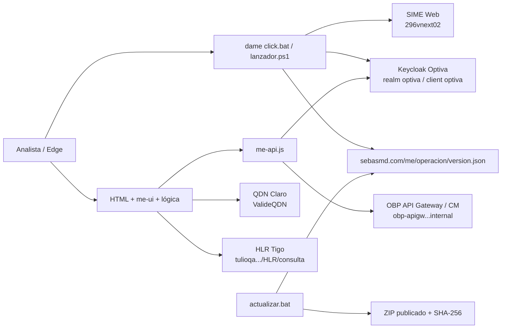

# Contexto de continuidad para Codex

> Última actualización: 2026-09-18 · Zona horaria del proyecto: America/Bogota.
>
> Leer este archivo antes de modificar la suite. La documentación funcional
> detallada vive en `doc/`; este archivo resume arquitectura, conexiones,
> decisiones y estado de publicación para retomar el trabajo sin redescubrirlo.

## 1. Qué es este proyecto

Suite local de herramientas operativas de **Móvil Éxito**. Se distribuye como
HTML/CSS/JavaScript estático y se abre mediante `dame click.bat`. No tiene
backend propio: el navegador consulta directamente servicios internos de SIME,
Optiva/CM, QDN Claro y HLR Tigo.

- Entorno principal: Windows + Windows PowerShell 5.1 + Edge/Chromium.
- El lanzador abre Edge con la configuración necesaria para los servicios
  internos; no asumir que abrir un HTML con doble clic tendrá el mismo CORS.
- No hay build de Node ni dependencias instalables. Las librerías visuales se
  cargan desde CDN.
- La carpeta puede no comportarse como un repositorio Git normal en el entorno
  de trabajo. No depender de Git para descubrir o preservar cambios.

Documentos de entrada:

- `doc/GETTINGSTARTED.md`: uso y publicación.
- `doc/README.md`: catálogo y convenciones.
- `doc/lanzador/README.md`: lanzador, actualización y empaquetado.
- `doc/<herramienta>/README.md`: reglas de negocio de cada módulo.

## 2. Mapa de archivos

```text
index.html                         catálogo/inicio
dame click.bat                     wrapper del lanzador
actualizar.bat                     wrapper del actualizador manual
scripts/
  lanzador.ps1                     sesiones iniciales, Edge y aviso de versión
  actualizar.ps1                   descarga, SHA-256, extracción y aplicación
  empaquetar-release.ps1/.bat      crea ZIP + version.json
  VERSION                          versión global publicada
herramientas/*.html                marcado; evitar poner reglas de negocio aquí
assets/
  me-ui.js / me-ui.css             shell, pasos, tablas, exportación, copiar
  me-api.js                        Keycloak y acceso común al CM
  logica-<modulo>.js               reglas, consultas y transformación
  logica-paquetes-carga.js         carga de paquetes en el CM (escritura)
  me-<modulo>-puente.js            eventos entre shell, HTML y lógica
doc/<modulo>/README.md              documentación e historial
release/                            artefactos que se suben al servidor
```

Regla arquitectónica: conservar la separación **HTML = marcado**, **lógica =
`logica-*.js`**, **integración visual = `me-*-puente.js`**, **servicios comunes =
`me-api.js`/`me-ui.js`**.

## 3. Herramientas principales

| App | Entrada | Lógica principal | Propósito |
|---|---|---|---|
| Inicio | `index.html` | `assets/logica-inicio.js` | Catálogo y descarga de herramientas. |
| Prepagadas | `reporte_prepagadas.html` | `logica-prepagadas.js` | Cruce SIME ⇄ CM. |
| Consumos | `reporte_consumos.html` | `logica-consumos.js` + `logica-paquetes-carga.js` | Línea, titular, paquetes, movimientos y CDR. **Carga de paquetes** (única escritura) en el segundo archivo. |
| Ajustes/Paquetes | `export_ajustes.html` | `logica-ajustes.js` | Ajustes de dinero y paquetes del CM. |
| Tipificación | `export_tipificacion.html` | `logica-tipificacion.js` | Exportación de casos. |
| Casos masivos | `reporte_casos_masivos.html` | `logica-casos.js` | Cierre/anotación masiva. |
| Rechazos | `generar_rechazo.html` | `logica-rechazo.js` | PDF de rechazo de portabilidad. |
| HLR/HSS | `hlr_hss.html` | `logica-hlr-hss-{claro,tigo,ambos}.js` | Consulta/operación por operador y cruce. |
| Audio a MP3 | `convertir_audio_mp3.html` | `logica-audio-mp3.js` | Conversión local individual o por lotes a `mp3-*.mp3`. |

Existen páginas independientes heredadas para QDN Tigo, portabilidad Tigo y
cruce HLR. Si se modifica el motor de la pestaña **Ambos** en HLR/HSS, revisar
también `logica-hlr-cruzado.js`; ambos son copias deliberadas y pueden divergir.

## 4. Mapa de conexiones



Conexiones base:

| Sistema | Base/entrada | Autenticación | Uso |
|---|---|---|---|
| Keycloak | `http://keycloak.exito-prod.movil-exito.internal` | Password grant, realm/client `optiva` | Token del CM. |
| CM/Optiva | `http://obp-apigw.exito-prod.movil-exito.internal` | Bearer mediante `me-api.js` | Suscriptores, cuentas, individuos, casos, ajustes, consumos. |
| SIME | `http://296vnext02.grupo-exito.com/SIME/Web` | Sesión Windows o credencial | Reporte de prepagadas. |
| QDN Claro | ruta `.../ValideQDN/{msisdn}` | Configuración del motor Claro | Consulta y operaciones HLR/HSS. |
| HLR Tigo | `https://tulioqa.grupo-exito.com/apimew/api/v1/autogestion/HLR/consulta` | X-Api-Key/configuración del motor | Consulta de perfil Tigo. |
| Releases | `https://sebasmd.com/me/operacion/` | HTTPS público interno/aprobado | `version.json` y ZIP. |

### Flujo para titular y documento

```text
MSISDN
  -> subscriber/subscriptionProfile
  -> accountID o BAN
  -> billingAccount
  -> parentId / accountRelationship (hasta 5 saltos)
  -> relatedParty Individual
  -> /api/v1/individual/{id}
  -> individualIdentification + fullName/givenName/familyName
```

La lógica actual es más robusta que el flujo lineal de Postman que se revisó:

- prueba BAN con y sin sufijo;
- usa consulta simple, filtro alternativo y búsqueda por id;
- recorre hasta cinco niveles y no supone que la primera relación es la útil;
- toma el primer documento no vacío y soporta múltiples BAN;
- descarta el nombre de prueba `FirstName LastName` donde aplica.

Del flujo de Postman se incorporaron dos respaldos importantes:

1. usar `individual.fullName` antes de reconstruir nombre/apellido;
2. probar `billingAccount.id` como `individualID` cuando no llega una relación
   `Individual` (un 404 se absorbe y continúa la búsqueda).

Mantener alineada esta resolución al menos en `logica-consumos.js`,
`logica-rechazo.js` y `logica-ajustes.js`.

## 5. Versionamiento y releases

Convención oficial desde la release **2.2.0**: `Major.Minor.Patch` (`X.Y.Z`).

- `X` Major: cambio mayor/incompatible; siguiente = `(X+1).0.0`.
- `Y` Minor: funcionalidad compatible; siguiente = `X.(Y+1).0`.
- `Z` Patch: fix o documentación; siguiente = `X.Y.(Z+1)`.
- Versiones históricas incompletas se normalizan: `2.2 == 2.2.0`.

Empaquetado interactivo:

```bat
scripts\empaquetar-release.bat
```

Empaquetado no interactivo:

```bat
scripts\empaquetar-release.bat -Incremento Fix -Notas "..."
scripts\empaquetar-release.bat -Incremento Minor -Notas "..."
scripts\empaquetar-release.bat -Incremento Major -Notas "..."
scripts\empaquetar-release.bat -Version 3.0.0 -Notas "..."
```

El empaquetador actualiza `scripts/VERSION`, crea
`release/me-operacion-X.Y.Z.zip`, calcula SHA-256 y genera `release/version.json`.
Subir siempre **el JSON y el ZIP que fueron generados juntos**.

Reglas críticas:

- `version.json` es la autoridad final: después de copiar el ZIP,
  `actualizar.ps1` vuelve a escribir la versión publicada para evitar que un
  `scripts/VERSION` viejo dentro del paquete provoque descargas repetidas.
- El JSON se escribe UTF-8 sin BOM, normalizado NFC y con caracteres no ASCII
  escapados como `\uXXXX`.
- Lanzador/actualizador leen los bytes como UTF-8 estricto y comparan los tres
  componentes con `[version]`.
- No editar solamente `version.json` para apuntar a una versión inexistente.
- No reutilizar un número ya publicado. Un cambio posterior debe incrementar
  Patch y producir un ZIP/hash nuevos.

### Estado observado al crear este archivo

- `scripts/VERSION`: **2.2.1**.
- `release/version.json`: **2.2.1**.
- ZIP: `release/me-operacion-2.2.1.zip`.
- El SHA-256 publicado coincide con el ZIP.
- Las notas de `release/version.json` estaban vacías en ese momento. Antes de
  subir, completar `notas` y volver a validar JSON, nombre y hash. Cambiar solo
  las notas no altera el hash del ZIP.

## 6. Cambios recientes que no deben perderse

### Actualización y codificación

- Lectura de `version.json` en UTF-8 estricto + normalización NFC.
- Escape `\uXXXX` al generar notas.
- Versión publicada reescrita después de `robocopy`.
- Empaquetador con selección Fix/Minor/Major/personalizada.

### HLR/HSS

- La tarjeta **Ambos / no concluyente** es un filtro rápido.
- El desplegable Ubicación ofrece el grupo y también ambos valores separados.
- Se modificaron el motor fusionado y el cruce independiente; mantenerlos
  sincronizados.

### Titular, CC y copia rápida

- Consumos `1.7.0`: CC en la cabecera del modal con botón de copia; titular con
  respaldos `fullName` y `account.id`.
- Ajustes/Paquetes `2.1.0`: resuelve número + CC por cuenta; CC es una columna
  inicial copiable y viaja en CSV/Excel/JSON.
- Rechazos `2.1.1`: mismos respaldos nuevos para titular.
- `me-ui.js` delega `.btn-copy` y soporta `data-copy-target` o
  `data-copy-text`, con fallback para `file://`/HTTP sin Clipboard API.

### Carga de paquetes (Consumos 1.8.0)

- Es **la única escritura de toda la suite** fuera de Casos y HLR Claro, y vive
  aparte en `assets/logica-paquetes-carga.js` (IIFE, expone `window.MEPAQ`);
  no puede declarar globales sueltas porque comparte página con
  `logica-consumos.js`.
- El flujo del CM está documentado endpoint por endpoint, con los cuerpos
  reales, en `doc/reporte-ajustes/recarga-de-paquetes-cm.md`. **Leer eso antes
  de tocar el carrito o la orden**: la orden se arma desde la RESPUESTA del
  carrito a propósito, y los paquetes ya activos no se reenvían.
- Guardas que no se quitan sin una captura que las reemplace: solo precio 0,
  sin reintento de `productOrder` (el CM no deduplica), carrito borrado
  siempre, verificación contra `subscriberProfile` y no contra el `200`.
- Sigue pendiente: cómo se arma el cobro cuando el paquete tiene precio y qué
  `action` retira un paquete (sección 6 de ese documento).

### Documentación
- `doc/generar-rechazo/README.md` fue normalizado a la estructura común e
  incluye historial.
- Todos los encabezados y documentos deben usar la convención X.Y.Z.

## 7. Riesgos y verificaciones

- No inventar datos: si CM no devuelve documento/nombre, mostrar vacío o `—`;
  no inferir una CC.
- En Ajustes/Paquetes, resolver número y CC agrega varias peticiones por cuenta;
  existe una casilla para omitir el enriquecimiento en volúmenes grandes.
- CUN de Rechazos sigue manual; no se conoce todavía el endpoint.
- La fecha de desactivación de Rechazos usa `status.startDate` con estado 2 y
  aún merece contraste funcional con un caso real.
- El ZIP del release no incluye `empaquetar-release.ps1/.bat` por diseño.
- Las credenciales viven fuera del proyecto o en memoria/localStorage según el
  flujo. Nunca escribir usuarios, contraseñas, tokens o API keys en este archivo.
- Postman puede contener entornos con secretos: antes de conservar o publicar
  esos archivos, verificar que los campos sensibles estén vacíos.
- Audio a MP3 usa Web Audio para decodificar, normaliza a 44,1 kHz y codifica
  con `lamejs`; los lotes se descargan con `JSZip`. Ambas librerías se cargan
  por CDN. Los formatos de entrada efectivos dependen de los códecs de Edge;
  OGG/Opus y M4A/AAC son los formatos iniciales objetivo. Todo el audio se
  procesa localmente y nunca se envía a los servicios internos.

Validación mínima después de cambios:

```bash
node --check assets/logica-archivo-modificado.js
```

Para una release:

1. Confirmar versión y notas.
2. Confirmar que el ZIP contiene `scripts/VERSION` correcto.
3. Comparar el SHA-256 real con `release/version.json`.
4. Probar actualización desde la versión anterior.
5. Abrir la herramienta afectada mediante `dame click.bat` y probar con un caso
   real controlado; las pruebas estáticas no validan CORS, VPN ni respuestas CM.

## 8. Forma recomendada de continuar

1. Leer este archivo y el README específico del módulo.
2. Buscar primero en `logica-*.js`; no duplicar reglas en HTML o puente.
3. Si se toca una lógica copiada (HLR Ambos/cruce, titular en
   Consumos/Rechazos/Ajustes), revisar todas sus copias.
4. Actualizar versión de la herramienta e historial según X.Y.Z.
5. Ejecutar comprobación sintáctica y revisar manualmente el flujo afectado.
6. Solo después preparar la siguiente release global y sus notas.
