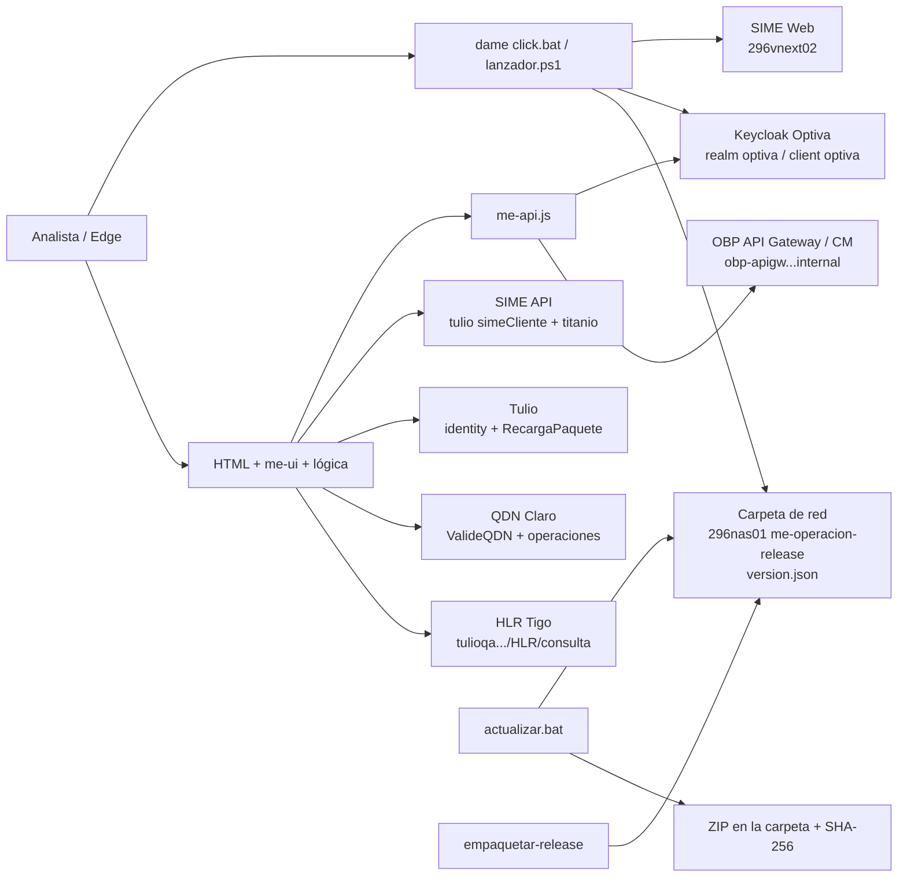

# Contexto de continuidad para Codex

> Última actualización: 2026-09-30 · Zona horaria del proyecto: America/Bogota.
>
> Leer este archivo antes de modificar la suite. La documentación funcional
> detallada vive en `doc/`; este archivo resume arquitectura, conexiones,
> decisiones y estado de publicación para retomar el trabajo sin redescubrirlo.

## 1. Qué es este proyecto

Suite local de herramientas operativas de **Móvil Éxito**. Se distribuye como
HTML/CSS/JavaScript estático y se abre mediante `dame click.bat`. No tiene
backend propio: el navegador consulta directamente servicios internos de SIME,
Optiva/CM, Tulio, QDN Claro y HLR Tigo.

- Entorno principal: Windows + Windows PowerShell 5.1 + Edge/Chromium.
- El lanzador abre Edge con la configuración necesaria para los servicios
  internos; no asumir que abrir un HTML con doble clic tendrá el mismo CORS.
- No hay build de Node ni dependencias instalables. Las librerías visuales se
  cargan desde CDN.
- El código está en Git (`github.com/sebasmd-projects/me-operacion`, rama
  `master`). **El repositorio es público**: ver §7 antes de subir cualquier
  cosa. La distribución a los analistas NO usa Git: va por ZIP + `version.json`
  (§5).

Documentos de entrada:

- `doc/GETTINGSTARTED.md`: uso y publicación.
- `doc/README.md`: catálogo y convenciones.
- `doc/lanzador/README.md`: base compartida, lanzador, actualización y empaquetado.
- `doc/<herramienta>/README.md`: reglas de negocio e historial de cada módulo.

## 2. Mapa de archivos

```text
index.html                         catálogo/inicio
dame click.bat                     wrapper del lanzador
actualizar.bat                     wrapper del actualizador manual
scripts/
  lanzador.ps1                     sesiones iniciales, Edge y aviso de versión
  actualizar.ps1                   descarga, SHA-256, extracción y aplicación
  empaquetar-release.ps1/.bat      crea ZIP + version.json (no se distribuye)
  VERSION                          versión global publicada
herramientas/*.html                marcado; evitar poner reglas de negocio aquí
assets/
  me-ui.js / me-ui.css             shell, pasos, tablas, exportación, copiar
  me-api.js                        Keycloak y acceso común al CM
  logica-<modulo>.js               reglas, consultas y transformación
  logica-paquetes-carga.js         carga de paquetes en el CM desde Consumos (window.MEPAQ)
  logica-qdn-operaciones.js        operaciones de red QDN Claro (bloqueos, conciliación, provisión)
  cm-lineas.js                     órdenes de línea del CM compartidas (window.CMLineas)
  me-<modulo>-puente.js            eventos entre shell, HTML y lógica
doc/<modulo>/README.md             documentación e historial
release/                           artefactos que se suben al servidor
```

Regla arquitectónica: conservar la separación **HTML = marcado**, **lógica =
`logica-*.js`**, **integración visual = `me-*-puente.js`**, **servicios comunes =
`me-api.js`/`me-ui.js`**. Los archivos que comparten página con otra lógica
(`logica-paquetes-carga.js`, `cm-lineas.js`) son IIFE y exponen un solo objeto
global: no declarar funciones sueltas de nivel superior, porque los scripts
clásicos comparten el ámbito global y un nombre repetido pisa al otro (ya pasó
con `celdaUso`).

## 3. Herramientas principales

| App (`id`) | Entrada | Lógica principal | Propósito | ¿Escribe? |
|---|---|---|---|---|
| Inicio | `index.html` | `logica-inicio.js` | Catálogo y descarga de herramientas. | No |
| Prepagadas (`prepagadas`) | `reporte_prepagadas.html` | `logica-prepagadas.js` | Cruce SIME ⇄ CM; alta de suscripción y edición de recurrencias en SIME. | Sí, SIME |
| Consumos (`consumos`) | `reporte_consumos.html` | `logica-consumos.js` + `logica-paquetes-carga.js` | Línea, titular, paquetes, movimientos y CDR; **carga de paquetes** en el CM. | Sí, CM |
| Ajustes/Paquetes (`ajustes`) | `export_ajustes.html` | `logica-ajustes.js` | Ajustes de dinero y paquetes del CM. | No |
| Titularidad (`titularidad`) | `titularidad.html` | `logica-titularidad.js` | Log de titularidad de **Genesis** cruzado con CM y HLR/HSS. Única que habla con Genesis. | No |
| Tipificación (`tipificacion`) | `export_tipificacion.html` | `logica-tipificacion.js` | Exportación de casos. | No |
| Casos masivos (`casos`) | `reporte_casos_masivos.html` | `logica-casos.js` | Cierre/anotación masiva (con simulación). | Sí, CM |
| Rechazos (`rechazo`) | `generar_rechazo.html` | `logica-rechazo.js` | PDF de rechazo de portabilidad. | No |
| Aplicar PLU (`plu`) | `aplicar_plu.html` | `logica-plu.js` | PLU en Tulio (`RecargaPaquete`) + verificación y borrado de bolsillos en el CM. | Sí, Tulio + CM |
| Estado de líneas (`estado-lineas`) | `estado_lineas.html` | `logica-estado-lineas.js` + `cm-lineas.js` | Bloquear/inactivar líneas en masivo. | Sí, CM |
| Cambio de IMSI (`cambio-imsi`) | `cambio_imsi.html` | `logica-cambio-imsi.js` + `cm-lineas.js` | Cambio de SIM en masivo (`línea;imsi_nueva`). | Sí, CM |
| HLR/HSS (`hlr-hss`) | `hlr_hss.html` | `logica-hlr-hss-{claro,tigo,ambos}.js` | Consulta por operador y cruce; pestaña Claro opera la línea. | Sí, red Claro |
| Portabilidad Tigo (`portabilidad-tigo`) | `validador_portabilidad_tigo.html` | `logica-portabilidad-tigo.js` | HLR Tigo con marco de portabilidad. | No |
| Audio a MP3 (`audio-mp3`) | `convertir_audio_mp3.html` | `logica-audio-mp3.js` | Conversión local a `mp3-*.mp3`. | No |

Existen páginas independientes heredadas (fuera del menú) para QDN Claro
(`validador_qdn.html` + `logica-qdn.js` + `logica-qdn-operaciones.js`), QDN Tigo
y cruce HLR. **Copias deliberadas que pueden divergir**:

- pestaña **Ambos** de HLR/HSS ⇄ `logica-hlr-cruzado.js`;
- pestaña **Claro** de HLR/HSS (`logica-hlr-hss-claro.js`) ⇄ `logica-qdn.js` +
  `logica-qdn-operaciones.js` (operaciones, `USUARIOS_PROVISION`, KI).

Si se toca una, revisar la otra.

### Operaciones restringidas por usuario

Guardas de interfaz (no control de acceso: el servicio acepta cualquier sesión
válida). Todas exigen además sesión del CM vigente:

| Constante | Archivo | Qué habilita |
|---|---|---|
| `USUARIO_AGREGAR_PLU` | `logica-plu.js` | Aplicar/eliminar PLU. |
| `USUARIOS_AUTORIZADOS` | `cm-lineas.js` | Estado de líneas y Cambio de IMSI. |
| `USUARIOS_PROVISION` | `logica-hlr-hss-claro.js` y `logica-qdn-operaciones.js` | Aprovisionar/desaprovisionar (POST/DELETE) en QDN Claro. |

Hoy todas valen `["jpelaezg"]`.

## 4. Mapa de conexiones


```mermaid
flowchart LR
    U[Analista / Edge] --> L[dame click.bat / lanzador.ps1]
    L --> S[SIME Web<br/>296vnext02]
    L --> K[Keycloak Optiva<br/>realm optiva / client optiva]
    U --> UI[HTML + me-ui + lógica]
    UI --> API[me-api.js]
    API --> K
    API --> CM[OBP API Gateway / CM<br/>obp-apigw...internal]
    UI --> SM[SIME API<br/>tulio simeCliente + titanio]
    UI --> TU[Tulio<br/>identity + RecargaPaquete]
    UI --> QC[QDN Claro<br/>ValideQDN + operaciones]
    UI --> HT[HLR Tigo<br/>tulioqa.../HLR/consulta]
    L --> V[Carpeta de red<br/>296nas01 me-operacion-release<br/>version.json]
    A[actualizar.bat] --> V
    A --> Z[ZIP en la carpeta + SHA-256]
    E[empaquetar-release] --> V
```

Conexiones base:

| Sistema | Base/entrada | Autenticación | Uso |
|---|---|---|---|
| Keycloak | `http://keycloak.exito-prod.movil-exito.internal` | Password grant, realm/client `optiva` | Token del CM. |
| CM/Optiva | `http://obp-apigw.exito-prod.movil-exito.internal` | Bearer mediante `me-api.js` | Suscriptores, cuentas, individuos, casos, ajustes, consumos, carritos y órdenes. |
| SIME Web | `http://296vnext02.grupo-exito.com/SIME/Web` | Sesión Windows (NTLM) → token `prf` | Emite el `prf`. |
| SIME API | `https://tulio.grupo-exito.com/apimew/api/v1/simeCliente/...` y `https://titanio.grupo-exito.com/apiow/api/v1/DFXRWFBFZM/...` | Cabecera `prf` | Consulta, catálogo de planes (`GetCanalTipo`), alta (`Suscription/registrar`) y recurrencias. |
| Tulio | `https://tulio.grupo-exito.com` (`/identity/connect/token`, `.../Recarga/RecargaPaquete`) | `client_credentials` + `X-Api-Key` | Aplicar PLU. |
| QDN Claro | ruta `.../ValideQDN/{msisdn}` y operaciones | OAuth2 propio (en `logica-qdn.js` / motor Claro) | Consulta y operaciones HLR/HSS. |
| HLR Tigo | `https://tulioqa.grupo-exito.com/apimew/api/v1/autogestion/HLR/consulta` | `X-Api-Key` | Consulta de perfil Tigo. |
| Releases (3.0.0+) | `\\296nas01\TodosNal1\Especiales\Documentacion\Movil Exito\me-operacion-release` | Sin control: cualquiera con VPN lee y escribe | `version.json` y ZIP. Hasta 2.x era `https://sebasmd.com/me/operacion/` (solo queda para el puente). |

### Flujo para titular y documento

```text
MSISDN
  -> subscriber/subscriptionProfile
  -> accountID o BAN
  -> billingAccount   (externalID con coincidencia EXACTA, limit=10)
  -> parentId / accountRelationship (hasta 5 saltos)
  -> relatedParty Individual
  -> /api/v1/individual/{id}
  -> individualIdentification + fullName/givenName/familyName
```

- `billingAccount?externalID=` busca por **prefijo**: con `limit=1` la cuenta
  `…7510` puede devolver otra (`…75100`). Siempre pedir varias y quedarse con
  la de `externalID` exacto (`buscarBillingAccount` en Consumos, Rechazos y
  PLU; `cuentaCrm` en `cm-lineas.js`). Esto causó el 500 al eliminar PLU.
- Prueba BAN con y sin sufijo, filtro alternativo y búsqueda por id; recorre
  hasta cinco niveles; toma el primer documento no vacío; descarta el nombre de
  prueba `FirstName LastName`.
- Respaldos del flujo de Postman: `individual.fullName` antes de reconstruir el
  nombre, y `billingAccount.id` como `individualID` si no hay relación
  `Individual` (un 404 se absorbe).

Mantener alineada esta resolución en `logica-consumos.js`, `logica-rechazo.js`
y `logica-ajustes.js`.

### Órdenes del CM (escritura)

Todas siguen el patrón de la interfaz del CM: **carrito → orden → seguimiento
→ borrar el carrito siempre** (un carrito colgado lo puede reenviar la interfaz
del CM después; ver la orden `SwitchCarrier` accidental documentada en
`doc/cambio-imsi/README.md` §4).

| Operación | Tipo de orden | Dónde |
|---|---|---|
| Cargar paquete | `ChangeOffer` (ADD) | `logica-paquetes-carga.js` · `doc/reporte-ajustes/recarga-de-paquetes-cm.md` |
| Eliminar bolsillos de un PLU | `ChangeOffer`; ERCRT1002 se resuelve agregando la dependencia como `NO_CHANGE` | `logica-plu.js` |
| Bloquear / inactivar | `ChangeSubscriptionState` (oferta 10008: `10006` → estado 5, `10007` → estado 2) | `cm-lineas.js` |
| Cambio de IMSI | `ChangeSim` (oferta 10012, producto 10010, `userData` de 28 campos) | `cm-lineas.js` |

Cabecera `Transaction-Id` con el formato `DCRM-TRXyyyyMMddHHmmss-NNN`. El
seguimiento usa `productOrder?customerBan="…"` (con comillas; se prueba también
sin ellas). Inactivar deja la IMSI en **HELD** y liberarla es manual en el BSS;
el código de estado HELD en `cardPackage` aún no se conoce (1 = Disponible,
2 = En uso).

## 5. Versionamiento y releases

Convención oficial desde la release **2.2.0**: `Major.Minor.Patch` (`X.Y.Z`).

- `X` Major: cambio mayor/incompatible; siguiente = `(X+1).0.0`.
- `Y` Minor: funcionalidad compatible; siguiente = `X.(Y+1).0`.
- `Z` Patch: fix o documentación; siguiente = `X.Y.(Z+1)`.
- Versiones históricas incompletas se normalizan: `2.2 == 2.2.0`.
- Cada herramienta tiene además su propia versión: comentario de la primera
  línea del HTML, `MEUI.init({ version })` (o su puente) y encabezado + historial
  del README. **Las tres deben coincidir.**

Empaquetado interactivo:

```bat
scripts\empaquetar-release.bat
```

Empaquetado no interactivo:

```bat
scripts\empaquetar-release.bat -Incremento Fix -Notas "..."
scripts\empaquetar-release.bat -Incremento Minor -Notas "..."
scripts\empaquetar-release.bat -Incremento Major -Notas "..."
scripts\empaquetar-release.bat -Version 3.0.0 -Notas "..."
```

El empaquetador actualiza `scripts/VERSION`, crea
`release/me-operacion-X.Y.Z.zip`, calcula SHA-256, genera `release/version.json`
y, desde la 3.0.0, **publica los dos en la carpeta de red** (ZIP primero,
hash de la copia verificado, `version.json` al final; `-SinPublicar`,
`-Destino`, `-Forzar`, `-Puente`). Sin acceso a la carpeta deja todo en
`release/` y dice qué copiar. Publicar siempre **el JSON y el ZIP que
fueron generados juntos**.

Lanzador y actualizador leen de esa carpeta (`$RELEASE_DIR`, con
`/origen:"<carpeta>"` para pruebas). La lectura de `version.json` tiene un
tope de 6 s (lanzador) / 20 s (actualizador) en un runspace aparte, porque
SMB sin VPN puede colgarse 20-60 s. El `zip` de `version.json` debe ser un
nombre de archivo suelto y el `sha256` es obligatorio.

**Puente 2.x → 3.0.0**: las copias instaladas solo miran `sebasmd.com`. La
3.0.0 se empaqueta con `-Puente` y se sube también, una última vez, al
dominio; al instalarla, cada equipo pasa a la carpeta de red. Plan y pruebas
en `doc/lanzador/plan-3.0.0.md`.

Reglas críticas:

- `version.json` es la autoridad final: después de copiar el ZIP,
  `actualizar.ps1` vuelve a escribir la versión publicada para evitar que un
  `scripts/VERSION` viejo dentro del paquete provoque descargas repetidas.
- El JSON se escribe UTF-8 sin BOM, normalizado NFC y con caracteres no ASCII
  escapados como `\uXXXX`.
- Lanzador/actualizador leen los bytes como UTF-8 estricto y comparan los tres
  componentes con `[version]`.
- No editar solamente `version.json` para apuntar a una versión inexistente.
- No reutilizar un número ya publicado. Un cambio posterior debe incrementar
  Patch y producir un ZIP/hash nuevos.

### Estado al 2026-09-30

- `scripts/VERSION` y `release/version.json`: **2.9.0**
  (`release/me-operacion-2.9.0.zip`, generado 2026-09-30 08:44; `notas` vacías).
- Los ZIP 2.6.2 a 2.9.0 de `release/` no están en Git (son artefactos).
- Cambios posteriores a ese ZIP, pendientes de la siguiente release (**3.0.0**,
  la primera desde la carpeta de red): Consumos 1.8.1, Prepagadas 9.3.1/9.4.0,
  la revisión de documentación de esta fecha y el nuevo canal de releases.
  Antes de empaquetar, confirmar con `git status` qué más entra.

Versiones actuales por herramienta: Prepagadas 9.4.0 · Consumos 1.8.1 ·
Ajustes 2.1.0 · Tipificación 2.0 · Casos 3.2 · Rechazos 2.1.1 · Aplicar PLU
1.5.0 · Estado de líneas 1.0.0 · Cambio de IMSI 1.0.0 · HLR/HSS 2.4 ·
Validador QDN 3.3 · QDN Tigo 1.2 · HLR cruzado 1.2 · Portabilidad Tigo 1.3 ·
Audio a MP3 1.0.0 · Base compartida/lanzador 3.0.0.

## 6. Cambios recientes que no deben perderse

### Actualización y codificación

- Lectura de `version.json` en UTF-8 estricto + normalización NFC.
- Escape `\uXXXX` al generar notas.
- Versión publicada reescrita después de `robocopy`.
- Empaquetador con selección Fix/Minor/Major/personalizada.

### Shell (`me-ui.js`)

- `APPS` incluye `plu`, `estado-lineas` y `cambio-imsi`; `logica-inicio.js`
  tiene sus fichas.
- Esc con modales anidados cierra primero el de encima (formulario) y después
  el de información.
- Evento `me:sesion-cambio` (solo cuando algo cambió) y `montarTogglePasos`.
- Detección de la columna de línea en CSV/Excel: alias en cualquier mayúscula
  más `ALIAS_LINEA_EXACTO` (`min`, `nro`, `num`, `no`, `tel`, `cel`).
- `MEUI.autoSpinner` se libera cuando el código hace `btn.disabled = false`:
  toda acción envuelta así debe reactivar el botón en un `finally`.

### Consumos (1.7.0 → 1.8.1) y Prepagadas (9.3 → 9.4.0)

- Uso y Balance muestra **consumido / total** y el **disponible** destacado.
- Paginación sin tope de resultados: la página del CM es de **500** (límite de
  la API, no del resultado). La única condición de fin es «la página no trajo
  nada nuevo» (terminar por «página corta» perdía registros), con reintentos
  cuando el CM corta la paginación.
- Carga de paquetes (1.8.0): única escritura de Consumos, en
  `logica-paquetes-carga.js`. Leer `doc/reporte-ajustes/recarga-de-paquetes-cm.md`
  antes de tocar el carrito o la orden: la orden se arma desde la RESPUESTA del
  carrito y los paquetes activos no se reenvían. Guardas que no se quitan sin
  captura que las reemplace: solo precio 0, sin reintento de `productOrder`,
  carrito borrado siempre, verificación contra `subscriberProfile`.
- 1.8.1: el catálogo de la oferta se **precarga al abrir el detalle**; antes el
  spinner quedaba en el botón que el panel oculta y parecía no cargar.
- Prepagadas 9.3.1: el `tipoSuscripcion` NO es «posición + 1» (desde los
  planes «Pague 8 Lleve 12» SIME va corrido en uno; mandar el id equivocado da
  400 «Object reference not set…»). `documento: "0"` es aceptado por SIME.
- Prepagadas 9.4.0: planes, canales y PLU de 1.ª compra **en vivo** desde
  `GET {simeBase}/GetCanalTipo`. Los catálogos fijos quedan de respaldo y el
  desplegable usa el nombre del plan como valor.

### HLR/HSS y QDN Claro (HLR/HSS 2.4 · Validador QDN 3.3)

- Menú de operaciones agrupado por familia con íconos; Conciliación y
  Aprovisionar/Desaprovisionar primero, luego Cambio de SIM y de número.
- KI **obligatoria** en el POST de aprovisionamiento y en la conciliación
  (que hace DELETE + POST); opcional en el DELETE. Si la línea no existe o está
  inactiva, los datos se ingresan a mano.
- Aprovisionar y Conciliación en masivo solo sobre las líneas marcadas; aviso
  de discrepancias contra el QDN.
- Reintentos automáticos ante errores de conexión en lotes grandes.
- La tarjeta **Ambos / no concluyente** es un filtro rápido.

### Aplicar PLU (1.0.0 → 1.5.0)

- Porte de `consola_bundles_movil_exito` sin Python. Secuencia 1 línea → N PLUs
  (consultar → agregar → eliminar → repetir), con barra de progreso por etapas
  y paquetes plegables.
- Cuadro «total · valor anterior · valor agregado» con el agregado resaltado.
- Evidencia en Excel (hoja Resumen + una hoja por PLU, igual que la consola) y
  en CSV.
- Credenciales de Tulio **dentro de `logica-plu.js`** por decisión explícita
  del responsable (ver §7).

### Estado de líneas y Cambio de IMSI (1.0.0)

- Tabla con casillas, filtros y ocultar/mostrar como el cierre de casos
  (`CMLineas.tablaSeleccionable`); solo se opera lo marcado y visible.
- Cada orden se sigue hasta su estado final (45 s) y la línea se relee.
- Cambio de IMSI: la IMSI nueva debe existir y estar Disponible; se revalida
  justo antes de enviar; nota obligatoria.
- «Activar» (`10005`) no está incluido: no hay captura de esa orden.

### Titularidad · Bloqueos de SIM (1.0.0)

- Única herramienta que habla con **Genesis** (`tulio.grupo-exito.com/apimew`,
  ruta `/RXDUURMWEECCKC/FechaExpedicion`). Su paginación va en una cabecera
  `pagination` en base64, no en la URL, y el servidor **puede conceder páginas
  más chicas de las que se piden** (100 frente a 500 en la captura): se recorre
  con el `pageSize` que DEVUELVE, no con el pedido. Avanzar con el pedido se
  saltaría cuatro de cada cinco registros sin que nada lo avisara.
- Orden ascendente por `id` + deduplicado: con descendente, cada registro nuevo
  que entra durante la descarga corre las páginas y se repiten y pierden filas.
- `request`/`response` (el SOAP crudo) se descartan al cargar: son ~2 KB por
  registro y hay más de 200.000. El detalle se vuelve a pedir al abrir la fila.
- Sesión propia (`genesis`), con **otro Keycloak** que el CM
  (`genesisv2.grupo-exito.com`, realm `GrupoExito`, cliente
  `genesismovilexito`). Desde `file://` el flujo de código no se puede
  completar: o usuario y contraseña (si el realm lo permite) o pegar el token
  de una sesión de Genesis abierta.
- `assets/hlr-consulta.js` es una **TERCERA copia** de las reglas de
  Claro/Tigo, junto a `logica-hlr-cruzado.js` y `logica-hlr-hss-ambos.js`.
  Se copió sin cambiar una línea. Si se cambia una regla, va en las tres.
- «En batch» aquí son **tandas controladas**: Claro no tiene servicio de lote,
  su QDN es una petición por línea.

### Documentación

- Todos los README usan la convención X.Y.Z en encabezado e historial.
- `doc/generar-rechazo/README.md` sigue la estructura común con historial.

## 7. Riesgos y verificaciones

- **Repositorio público.** Hay secretos en el código por decisión explícita
  del responsable: credenciales de Tulio (`logica-plu.js`), `client_secret` de
  QDN Claro y `X-Api-Key` de HLR Tigo (motores `logica-qdn*.js`/`logica-hlr-*.js`/
  `logica-portabilidad-tigo.js`). Quedan expuestos en el historial de Git:
  **rotarlos** cuando sea posible. Nunca escribir usuarios, contraseñas, tokens
  o API keys en este archivo ni en los README.
- **Capturas HAR y Postman**: traen tokens (`prf`, `refresh_token`), contraseñas
  y datos reales de clientes. No subirlas al repositorio (`har nuevas/`, `*.har`)
  y borrarlas cuando ya no se necesiten. `graphify-out/` es un artefacto local.
  Conviene un `.gitignore` con esas rutas.
- **Carpeta de releases sin control de escritura**: cualquiera con VPN puede
  reemplazar el ZIP y `version.json` (con su propio hash) y los analistas lo
  instalarían. El SHA-256 solo cubre copias incompletas. Pedir a TI solo
  lectura salvo para quien publica, si se puede.
- **Escrituras en producción**: Prepagadas (SIME), Consumos, Aplicar PLU, Estado
  de líneas, Cambio de IMSI, Casos y la pestaña Claro de HLR/HSS. Las guardas
  por usuario (§3) son de interfaz, no de seguridad.
- No inventar datos: si CM no devuelve documento/nombre, mostrar vacío o `—`;
  no inferir una CC.
- En Ajustes/Paquetes, resolver número y CC agrega varias peticiones por cuenta;
  existe una casilla para omitir el enriquecimiento en volúmenes grandes.
- CUN de Rechazos sigue manual; no se conoce todavía el endpoint.
- La fecha de desactivación de Rechazos usa `status.startDate` con estado 2 y
  aún merece contraste funcional con un caso real.
- El ZIP del release no incluye `empaquetar-release.ps1/.bat` por diseño.
- Audio a MP3 usa Web Audio + `lamejs` y `JSZip` por CDN; todo se procesa
  localmente y nunca se envía a los servicios internos.

Validación mínima después de cambios:

```bash
node --check assets/logica-archivo-modificado.js
```

Para una release:

1. Confirmar versión y notas.
2. Confirmar que el ZIP contiene `scripts/VERSION` correcto.
3. Comparar el SHA-256 real con `release/version.json`.
4. Probar actualización desde la versión anterior.
5. Abrir la herramienta afectada mediante `dame click.bat` y probar con un caso
   real controlado; las pruebas estáticas no validan CORS, VPN ni respuestas CM.

## 8. Pendientes conocidos

- Código de estado **HELD** en `cardPackage` (hoy se muestra `Estado N (¿HELD?)`).
- Orden de **Activar** línea (`10005`) sin captura.
- Cobro de paquetes con precio y la `action` que retira un paquete en la carga
  de Consumos (sección 6 de `recarga-de-paquetes-cm.md`).
- Catálogo PLU → bundles: no hay servicio conocido que lo liste.
- Titularidad: confirmar si el cliente `genesismovilexito` permite iniciar
  sesión con usuario y contraseña; si no, el único camino es pegar el token.
- Titularidad: comparar el documento de Genesis contra el del titular en el CM
  (la resolución subiendo por la cadena de cuentas ya existe en
  `logica-consumos.js`; no se portó para no dejar una cuarta copia).
- Revisar en el CM la orden `SOI7869437` (`SwitchCarrier` accidental, línea
  3338066365).

## 9. Forma recomendada de continuar

1. Leer este archivo y el README específico del módulo.
2. Buscar primero en `logica-*.js`; no duplicar reglas en HTML o puente.
3. Si se toca una lógica copiada (HLR Ambos/cruce, Claro/QDN, titular en
   Consumos/Rechazos/Ajustes), revisar todas sus copias.
4. Actualizar la versión de la herramienta en sus tres lugares (HTML, `init`,
   README) y agregar la fila del historial.
5. Ejecutar comprobación sintáctica y revisar manualmente el flujo afectado.
6. Solo después preparar la siguiente release global y sus notas.
