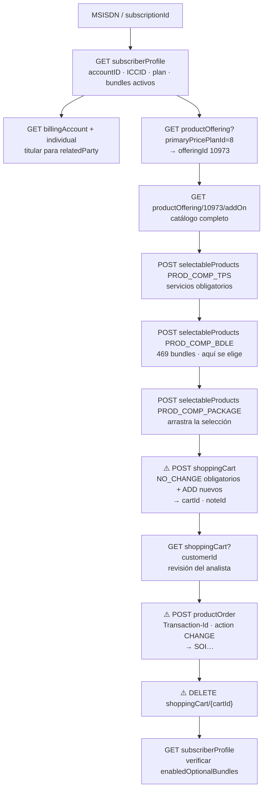

# Recarga / agregado de paquetes (bundles) en el CM — análisis del flujo

> **Estado: IMPLEMENTADO en «Bolsillos, Paquetes, Consumos»** (`reporte_consumos.html`
> v1.8.0, sección «Cargar paquete» del detalle de la línea · lógica en
> `assets/logica-paquetes-carga.js`). Este documento sigue siendo la
> referencia del flujo: describe el comportamiento real del front del CM
> (`obp-cms-frontend`) y es contra él que se validó la implementación.
> La sección 6 (preguntas abiertas) **sigue abierta** y explica por qué la
> herramienta solo carga paquetes de precio 0 y por qué no retira paquetes.
>
> Fuente: captura HAR `recargar_bundles.har` (23/09/2026, 13:46–13:49 UTC ·
> 08:46–08:49 hora Colombia), 179 peticiones, de las cuales 40 van al gateway
> del CM. Caso real: línea **3053218252** (`41020423354-1`), a la que se le
> agregaron **5 paquetes** en una sola orden.

---

## 1. Resumen en una frase

Agregar un paquete **no es un endpoint propio**: es una **orden de cambio de
oferta** (`ChangeOffer` / `changeProduct`) sobre el plan de precios que ya
tiene la línea, que se arma en un **carrito** y se confirma como **orden de
producto**. Lo que cambia entre el antes y el después son los `bundleId`
listados en `enabledOptionalBundles` del perfil del suscriptor.

Verificado en la captura:

| Momento | `enabledOptionalBundles` |
|---|---|
| Antes (13:47:10) | `[245, 471, 396, 205, 397, 398]` |
| Después (13:48:49) | `[241, 434, 244, 245, 471, 234, 396, 205, 397, 398, 238]` |

Los cinco nuevos son exactamente los cinco paquetes agregados: `234`, `238`,
`241`, `244`, `434`.

---

## 2. Conexión y cabeceras

| Dato | Valor en la captura |
|---|---|
| Gateway | `http://obp-apigw.exito-prod.movil-exito.internal` (KrakenD) |
| Origen | `http://obp-cms-frontend.exito-prod.movil-exito.internal` |
| Cabeceras del CM | `locale: en` · `spid: 410` · `tenant: optiva` |
| CORS | `Access-Control-Allow-Origin: *`; toda llamada con cabeceras propias dispara **preflight `OPTIONS`** |
| `Authorization` | **No viaja en esta captura.** El gateway respondió `200` solo con `locale/spid/tenant` |

Notas importantes para la implementación:

- El `Access-Control-Allow-Headers` del preflight **sí incluye `authorization`**,
  así que el token Bearer que ya pone `MEAPI` (`assets/me-api.js`) es aceptado.
  Es decir: se puede reutilizar `MEAPI.api()` tal cual, sin tocar el acceso común.
- La herramienta de Ajustes ya usa `MEAPI.configurar({ locale: "en" })`, que
  coincide con el `locale: en` de esta captura.
- Solo la creación de la **orden** agrega una cabecera extra:
  `Transaction-Id: DCRM-TRX20260923084839-715`, con forma
  `{CANAL}-TRX{yyyyMMddHHmmss en hora local}-{3 dígitos}`. El gateway la declara
  en el preflight de `productOrder`, y en ningún otro.
- Todo es **HTTP plano**, igual que el resto de la suite.

---

## 3. Endpoints utilizados

Ordenados por el papel que cumplen. Los marcados con ⚠️ **escriben**.

### 3.1 Contexto de la línea y del titular (solo lectura)

| Método | Endpoint | Para qué |
|---|---|---|
| `GET` | `/api/v1/subscriberProfile?identifier={msisdn-sub}` | Estado, `accountID`, `mobileNumber`, `imsi`/`cardPackageID`, `primaryPricePlanID` y **`enabledOptionalBundles`** (los paquetes activos). Es la fuente de verdad del antes/después. |
| `GET` | `/api/v1/billingAccount?externalID={accountID}&offset=0&limit=1` | Cuenta de facturación (`id` interno, p. ej. `771057`). |
| `GET` | `/api/v1/billingAccount/{id}?fields=parentGroupType` | Tipo de grupo (individual / familiar). |
| `GET` | `/api/v1/individual/{id}?fields=familyName,givenName,location` | Nombre del titular (`relatedParty` del carrito y de la orden). |
| `GET` | `/api/v1/customer/{id}` | Datos del cliente. |
| `GET` | `/api/v1/subscription?accountID={accountID}&recurse=true` | Suscripciones de la cuenta (ya se usa en Ajustes para resolver el número). |
| `GET` | `/api/v1/subscriptionProfile?subscriptionID={id}` | Perfil de la suscripción. |
| `GET` | `/api/v1/subscription/{subscriptionId}/pricePlan` | Opciones del plan con su vigencia (`PaqueteVigencia30DIAS`, `Paquete Familiar $19.900`…), con `adjustmentTypeID`, `fee`, `startDate`/`endDate` y `recurrence`. |

### 3.2 Catálogo de la oferta (solo lectura)

| Método | Endpoint | Para qué |
|---|---|---|
| `GET` | `/api/v1/productOffering?offeringType=PRICE_PLAN&category.id=MOB_CAT&billingType=Prepaid&channel=DCRM&subscriptionType=10001` | Planes prepago disponibles. |
| `GET` | `/api/v1/productOffering?offeringType=PRICE_PLAN&primaryPricePlanId={n}` | **Traduce el plan de la línea a la oferta.** `primaryPricePlanID=8` → `productOfferingId=10973` («Plan Prepago»). Este `10973` es la clave de todo lo que sigue. |
| `GET` | `/api/v1/productOffering/{offeringId}/addOn` | **Catálogo completo en una sola llamada** (~475 KB). Devuelve los componentes agrupados por tipo. |
| `POST` | `/api/v1/productOffering/{offeringId}/selectableProducts` | Catálogo **filtrado por tipo de componente** y por lo ya seleccionado. Es el que usa el asistente paso a paso. |

Tipos de componente que devuelve `addOn` para la oferta `10973`:

| `productTypeId` | Nombre | Ítems | Qué es |
|---|---|---|---|
| `PROD_COMP_TPS` | Service | 3 | Servicios obligatorios: Voz (`10038`), SMS (`10039`), Datos (`10040`). |
| `PROD_COMP_BDLE` | Bundle | **469** | **Los paquetes que nos interesan.** |
| `PROD_COMP_PACKAGE` | Package | 198 | Paquetes comerciales **con precio** (p. ej. «Presente Prepagada $74.700» = 74 700). |
| `PROD_COMP_ATPS` | Auxiliary Service | 91 | Servicios auxiliares. |
| `PROD_COMP_ABDLE` | Auxiliary Bundle | 39 | Bundles auxiliares. |
| `PROD_COMP_AUX_DIS` | Auxiliary Discount | 0 | — |
| `PROD_COMP_GRP` | PLP CUG | 3 | Grupos cerrados. |

### 3.3 Escritura ⚠️

| Método | Endpoint | Para qué |
|---|---|---|
| `GET` | `/api/v1/shoppingCart?customerId={accountID}` | Carrito vigente del cliente. Devuelve `[]` si no hay. |
| ⚠️ `POST` | `/api/v1/shoppingCart` | **Crea el carrito** con el cambio de oferta. Devuelve `id` de carrito y `note[].id`. |
| ⚠️ `POST` | `/api/v1/productOrder` | **Confirma la orden.** Devuelve `id` tipo `SOI7853692`. Aquí se aplica el cambio. |
| ⚠️ `DELETE` | `/api/v1/shoppingCart/{cartId}` | Limpia el carrito después de confirmar. |

---

## 4. Paso a paso: cómo se agrega un paquete

Secuencia exacta de la captura, con la hora local de cada hito.

### Paso 0 · Identificar la línea *(08:47:10)*

```txt
GET /api/v1/subscriberProfile?identifier=41020423354-1
```

De aquí salen todos los datos que después se repiten en el carrito y en la orden:

| Campo de la respuesta | Valor | Dónde se reusa |
|---|---|---|
| `subscriber.profile.accountID` | `41020423354` | `relatedParty[].id`, `customerId` |
| `subscriber.profile.identifier` | `41020423354-1` | `userData.SUBSCRIPTION_ID` |
| `subscriber.profile.mobileNumber` | `3053218252` | `userData.{grupo}_MSISDN` |
| `subscriber.profile.cardPackageID` / `imsi` | `732111252753873` | `userData.{grupo}_ICCID` |
| `subscriber.profile.spid` | `410` | `userData.SPID` + cabecera `spid` |
| `subscriber.profile.paidType` | `0` | `userData.PAIDTYPE` |
| `subscriber.rating.primaryPricePlanID` | `8` | `userData.EXISTING_PLAN_ID` y paso 1 |
| `subscriber.rating.enabledOptionalBundles` | `[245,471,396,205,397,398]` | Control antes/después |

En paralelo se resuelve el titular (`billingAccount` → `individual`), que da
`firstName`/`lastName` para `relatedParty`. En esta cuenta ambos son `"Default"`.

### Paso 1 · Del plan de la línea a la oferta *(08:47:13)*

```txt
GET /api/v1/productOffering?offeringType=PRICE_PLAN&primaryPricePlanId=8
   → productOfferingId = "10973"  ("Plan Prepago")
```

### Paso 2 · Cargar el catálogo de la oferta *(08:47:13)*

```txt
GET /api/v1/productOffering/10973/addOn
```

Una sola llamada trae los 469 bundles con `productId`, `productCode`,
`name` y `attributes.bundleId`.

### Paso 3 · Asistente de selección, en cadena *(08:47:20 → 08:48:20)*

Tres `POST` a `selectableProducts`, **cada uno arrastrando lo ya elegido**.
El front los dispara conforme el analista avanza por el asistente.

**3.a · Servicios obligatorios** *(08:47:20)*

```json
POST /api/v1/productOffering/10973/selectableProducts
{ "productTypeId": "PROD_COMP_TPS" }
```

Devuelve los 3 servicios con `optional: false` → se seleccionan siempre:
`10039` (SMS), `10038` (Voz), `10040` (Datos).

**3.b · Bundles disponibles** *(08:47:36)* — **este es el paso donde se elige el paquete**

```json
POST /api/v1/productOffering/10973/selectableProducts
{
  "productTypeId": "PROD_COMP_BDLE",
  "selectedProducts": [
    { "productTypeId": "PROD_COMP_TPS",
      "products": [ {"productId":"10039"}, {"productId":"10038"}, {"productId":"10040"} ] }
  ]
}
```

Devuelve `selectableProducts` con 469 bundles. Cada ítem:

```json
{
  "productCode": "BUNDLE-244",
  "productId": "10207",
  "name": "Paquete $19.900 10GB 30 dias-244",
  "description": "Paquete $19.900 10GB 30 dias-244",
  "price": { "priceType": "NR", "priceAmount": 0, "partnerPrice": "0E-10" },
  "attributes": { "bundleId": "244" },
  "optional": true
}
```

Reglas que se deducen del cuerpo:

- `optional: false` → **obligatorio, va siempre**. En esta oferta el único es
  `10185` / `BUNDLE-205` («Package Reversal Bundle-205»), que además trae
  `dependencies` de tipo `Mandatory` contra la oferta `10973`.
- `optional: true` → lo elige el analista.
- **Tres identificadores distintos, no confundirlos:**
  - `productId` (`10207`) → es lo que viaja en el carrito y en la orden.
  - `attributes.bundleId` (`244`) → es lo que aparece en `enabledOptionalBundles`.
  - `productCode` (`BUNDLE-244`) → `BUNDLE-` + `bundleId`.
  - El `name` termina en `-{bundleId}`, lo que permite buscar por nombre.

**3.c · Paquetes comerciales** *(08:48:20)*

```json
POST /api/v1/productOffering/10973/selectableProducts
{
  "productTypeId": "PROD_COMP_PACKAGE",
  "selectedProducts": [
    { "productTypeId": "PROD_COMP_TPS",  "products": [ {"productId":"10039"}, {"productId":"10038"}, {"productId":"10040"} ] },
    { "productTypeId": "PROD_COMP_BDLE", "products": [ {"productId":"10185"}, {"productId":"10207"}, {"productId":"10204"}, {"productId":"10197"}, {"productId":"10383"}, {"productId":"10201"} ] }
  ]
}
```

Aquí ya se ve la selección final de bundles: el obligatorio `10185` más los
cinco elegidos. En este caso **no se eligió ningún `PACKAGE`**, así que esta
llamada solo sirvió para pintar la siguiente pantalla del asistente.

Los cinco paquetes agregados en la captura:

| `productId` | `bundleId` | Nombre |
|---|---|---|
| `10207` | `244` | Paquete $19.900 10GB 30 dias |
| `10204` | `241` | Paquete $19.900 SMS 30 dias |
| `10201` | `238` | Paquete $19.900 MinIlim 30 dias |
| `10197` | `234` | WhatsApp 30 dias |
| `10383` | `434` | Facebook 30 dias |

### Paso 4 · Crear el carrito ⚠️ *(08:48:34)*

```json
POST /api/v1/shoppingCart
{
  "relatedParty": [
    { "id": "41020423354", "firstName": "Default", "lastName": "Default", "role": "Customer" }
  ],
  "cartItem": [{
    "action": "MODIFY",
    "id": "00001",
    "index": 0,
    "itemGroupId": "6897",
    "productOffering": {
      "id": "10973",
      "quantity": 1,
      "includedItems": [
        { "id": "10039", "quantity": 1, "action": "NO_CHANGE" },
        { "id": "10038", "quantity": 1, "action": "NO_CHANGE" },
        { "id": "10040", "quantity": 1, "action": "NO_CHANGE" },
        { "id": "10185", "quantity": 1, "action": "NO_CHANGE" },
        { "id": "10207", "quantity": 1, "action": "ADD" },
        { "id": "10204", "quantity": 1, "action": "ADD" },
        { "id": "10197", "quantity": 1, "action": "ADD" },
        { "id": "10383", "quantity": 1, "action": "ADD" },
        { "id": "10201", "quantity": 1, "action": "ADD" }
      ]
    },
    "note": [{ "text": "", "author": "" }]
  }],
  "userData": [
    { "name": "EXISTING_PLAN_ID",  "value": "8" },
    { "name": "CHANGE_PRICE_PLAN", "value": false },
    { "name": "SUBSCRIPTION_ID",   "value": "41020423354-1" },
    { "name": "6897_MSISDN",       "value": "3053218252" },
    { "name": "SPID",              "value": "410" },
    { "name": "SCHEDULE",          "value": "IMMEDIATE" },
    { "name": "PAIDTYPE",          "value": "0" },
    { "name": "6897_ICCID",        "value": "732111252753873" },
    { "name": "orderType",         "value": "changeProduct" },
    { "name": "type",              "value": "ChangeOffer" },
    { "name": "CHANNEL",           "value": "0" }
  ],
  "channel": [{ "id": "DCRM" }]
}
```

Claves de este cuerpo:

- **`action` por ítem**: `NO_CHANGE` para lo que ya estaba (servicios
  obligatorios + bundle obligatorio), **`ADD` para cada paquete nuevo**.
- **Los bundles que la línea ya tenía activos NO se envían.** `245`, `471`,
  `396`, `397`, `398` no aparecen en el carrito y **siguen activos** después
  de la orden. Solo se manda el obligatorio de la oferta y lo que se agrega.
- **`itemGroupId` (`6897`) lo inventa el front.** No aparece en ninguna
  respuesta previa del API: se genera en el cliente al armar el carrito y se
  usa además como prefijo de `{grupo}_MSISDN` y `{grupo}_ICCID`. Al implementar,
  generar un número propio y usar el mismo en las tres partes.
- `SCHEDULE: IMMEDIATE` → se aplica de una, sin agendar.
- `CHANGE_PRICE_PLAN: false` → **no se cambia el plan**, solo sus componentes.
  (Es booleano, no cadena; el resto de `userData` son cadenas.)

**Respuesta:** el carrito completo, con `id` (`"35466"`), los `includedItems`
ya enriquecidos (nombre, precio, `priceType`, `attributes`, `mandatory`…),
`cartTotalPrice` y un `note[0].id` (`"101776"`) que **hay que conservar** para
el paso siguiente.

### Paso 5 · Revisar el carrito *(08:48:36)*

```txt
GET /api/v1/shoppingCart?customerId=41020423354
```

El front navega a la pantalla del carrito y lo relee. Es el punto natural de
confirmación del analista.

### Paso 6 · Confirmar la orden ⚠️ *(08:48:39)*

```txt
POST /api/v1/productOrder
Transaction-Id: DCRM-TRX20260923084839-715
```

El cuerpo **se arma desde la respuesta del carrito**, con estas diferencias:

| Carrito | Orden |
|---|---|
| `cartItem` | `productOrderItem` |
| `"action": "MODIFY"` | `"action": "CHANGE"` |
| `includedItems` mínimos (`id`, `quantity`, `action`) | `includedItems` **completos**, tal como los devolvió el carrito: `name`, `price`, `priceType`, `customerViewable`, `attributes`, `mandatory`, `sellable`, `description`, `otherPrices`, `priceTerm`, `productSpec` |
| `note` sin `id` | `note` con el `id` que devolvió el carrito (`101776`) y `date` |
| — | `productOffering` con `name`, `category`, `attributes`, `description` |
| — | `userData` añade `AMOUNT_PAID: "0"`, `AMOUNT: "0"`, `PAYMENT_METHOD: ""` |
| — | Raíz añade `type: "ChangeOffer"`, `atuBssTokenID: ""`, `notificationContact: ""`, `contactMedium: []` |

Se conservan iguales: `channel`, `relatedParty`, `index`, `itemGroupId` y todo
el resto de `userData`.

**Respuesta (`200`):**

```json
{
  "id": "SOI7853692",
  "orderDate": "2026-09-23T13:48:40",
  "payment": [{ "id": "EXTERNAL_PAYMENT" }],
  "orderTotalPrice": [
    { "priceType": "TAX", "price": 0.0 }, { "priceType": "NR", "price": 0.0 },
    { "priceType": "RC", "price": 0.0 },  { "priceType": "DISCOUNT", "price": 0.0 }
  ],
  "type": "ChangeOffer",
  "note": [{ "id": "101777" }]
}
```

El `id` (`SOI…`) es el comprobante que debe quedar en el registro de la
herramienta y, si aplica, en la tipificación del caso.

### Paso 7 · Limpiar el carrito ⚠️ *(08:48:44)*

```txt
DELETE /api/v1/shoppingCart/35466
   → { "responseMessage": "success", "message": "Deleted" }
```

Se hace **después** de la orden. Si no se borra, el carrito queda pegado al
cliente y el siguiente intento arranca sucio.

### Paso 8 · Verificar *(08:48:49)*

```txt
GET /api/v1/subscriberProfile?identifier=41020423354-1
   → enabledOptionalBundles: [241, 434, 244, 245, 471, 234, 396, 205, 397, 398, 238]
```

Los cinco `bundleId` nuevos aparecen a los ~10 segundos de la orden. **Esta es
la única verificación válida de que el paquete quedó cargado**: la respuesta
`200` de `productOrder` dice que la orden se creó, no que se aplicó.

---

## 5. Diagrama del flujo



---

## 6. Qué hace falta saber antes de implementar

Cosas que **la captura no resuelve** y que hay que confirmar con el negocio o
con otra captura antes de escribir código:

1. **Cobro.** En este caso los cinco bundles salieron con `priceAmount: 0`,
   `orderTotalPrice` en 0, `PAYMENT_METHOD` vacío y `payment: EXTERNAL_PAYMENT`.
   Es decir, **esta captura es un agregado sin cobro**. Los componentes
   `PROD_COMP_PACKAGE` sí traen precio (p. ej. `74700`); falta ver cómo se
   arman `AMOUNT`, `AMOUNT_PAID` y `PAYMENT_METHOD` cuando sí se cobra.
   **Hasta no tener eso claro, la implementación debe limitarse a bundles de
   precio 0.**
2. **Quitar un paquete.** El `action` del ítem admite al menos `ADD` y
   `NO_CHANGE`; falta confirmar el valor para retirar (`REMOVE`/`DELETE`) y si
   el flujo es el mismo.
3. **Origen de `itemGroupId`.** Se genera en el cliente (4 dígitos en la
   captura). Falta confirmar si el CM le exige algún rango o unicidad.
4. **Reglas de compatibilidad.** `selectableProducts` devuelve `dependencies`
   y `cardinality`; en esta oferta solo el bundle obligatorio las trae, pero
   otros planes pueden tener exclusiones que haya que respetar.
5. **Autorización.** En la captura no viaja `Authorization`. Hay que verificar
   con el token de `MEAPI` que el gateway acepta estas **escrituras** igual que
   acepta las lecturas que ya hace la suite.
6. **Idempotencia.** No se observó ningún control: repetir el `POST
   /productOrder` probablemente genera una segunda orden. El `Transaction-Id`
   parece de trazabilidad, no de deduplicación.
7. **Errores.** Todas las respuestas de la captura son `200`. No hay muestra de
   carrito rechazado, bundle incompatible ni orden fallida, así que el manejo
   de errores habrá que construirlo a ciegas y probarlo en un caso controlado.

---

## 7. Cómo quedó implementado

Quedó en **«Bolsillos, Paquetes, Consumos»** (`reporte_consumos.html`), no en
Ajustes: esa herramienta ya resuelve la línea y ya muestra sus paquetes
activos, así que agregar uno es el paso natural siguiente y no hay que volver
a pedir el número. Respeta la arquitectura de tres capas de la suite:

| Capa | Archivo | Qué le toca |
|---|---|---|
| Marcado | `herramientas/reporte_consumos.html` | Sección «Cargar paquete» dentro del modal de detalle: pasos, buscador, revisión y resultado. Sin reglas. |
| Lógica | `assets/logica-paquetes-carga.js` | Todo el flujo: perfil, oferta, catálogo, carrito, orden, limpieza y verificación. Archivo propio, porque es lo único que escribe. |
| Consulta | `assets/logica-consumos.js` | Solo dos enganches: monta la sección al abrir el detalle y refresca «Uso y Balance» cuando una orden queda aplicada. |
| Común | `assets/me-api.js` | **Sin cambios.** `MEAPI.api()` ya cubre `POST`/`DELETE` y las cabeceras; `Transaction-Id` va en `headers` de esa llamada. |

> `logica-paquetes-carga.js` va dentro de un IIFE y expone solo `window.MEPAQ`.
> Es obligatorio: se carga en la misma página que `logica-consumos.js`, y dos
> scripts clásicos no pueden declarar `CONFIG`, `auth` o `getJson` dos veces.

### Diferencias deliberadas con la captura

| La captura hace | La herramienta hace | Por qué |
|---|---|---|
| `GET /addOn` (≈475 KB) **y** tres `POST selectableProducts` | Solo dos `POST selectableProducts` (`PROD_COMP_TPS` y `PROD_COMP_BDLE`) | El `addOn` y el tercer `POST` (`PROD_COMP_PACKAGE`) solo alimentan pantallas del asistente del CM que aquí no existen. Los dos que quedan son los que dicen qué es obligatorio y cuáles son los bundles elegibles. |
| Deja el `itemGroupId` que generó su front | Genera uno propio (4 dígitos) por envío | No viene del API: lo inventa el cliente y se usa además como prefijo de `{grupo}_MSISDN` e `{grupo}_ICCID`. |
| Manda los componentes de la orden ordenados por id | Igual | Se copió el detalle para que el cuerpo salga idéntico y no quede una diferencia sin explicar. |

### Guardas implementadas

- **Revisión obligatoria antes de enviar**, con el cuerpo JSON exacto del
  carrito a la vista (mismo criterio que la simulación de Cierre masivo).
- **Una línea a la vez.** No hay carga masiva.
- **Solo precio 0**: cualquier selección con costo bloquea el botón de enviar.
- **Registro completo** en el log de la herramienta: selección, `cartId`,
  `Transaction-Id`, número de orden y resultado de la verificación.
- **El carrito se borra siempre**, haya fallado o no la orden; si el `DELETE`
  falla se avisa con el `cartId` para borrarlo desde el CM.
- **La orden no se reintenta.** El CM no deduplica: ante una respuesta
  incierta la herramienta para y lo dice.
- **La verificación es contra `subscriberProfile`**, no contra el `200` de la
  orden. Si el CM aún no refleja el cambio, ofrece verificar de nuevo en vez
  de darlo por fallido.
- **Al terminar se repinta con datos nuevos del CM**, no con el estado que
  «debería» haber quedado: paquetes (`bundleBalance`), tabla principal y
  —porque la compra es un movimiento nuevo— movimientos y consumo
  (`detailedSubscriptionTransaction` y `listDetailedCallDetailsWithBundles`).
  Estos dos solo si el rango en pantalla llega hasta hoy; si no, se avisa en
  vez de pagar una consulta paginada que traería lo mismo.

### Cómo se validó

Sin CM de pruebas, se validó **contra la propia captura**: se monta el marcado
real en un DOM, se le devuelven como CM las mismas respuestas del HAR y se
comparan el carrito y la orden que produce contra los cuerpos que el front del
CM envió de verdad — salen idénticos, salvo el `itemGroupId`, que es aleatorio
por diseño. También se ejercitó el camino de error (orden que falla): una sola
llamada a `productOrder`, carrito borrado igual, sin verificación ni refresco.

---

## 8. Referencia rápida de identificadores

| Concepto | Ejemplo | De dónde sale |
|---|---|---|
| `subscriptionId` | `41020423354-1` | Lo escribe el analista o se resuelve por MSISDN |
| `accountID` | `41020423354` | `subscriberProfile.subscriber.profile.accountID` |
| `billingAccount.id` | `771057` | `GET /billingAccount?externalID={accountID}` |
| `primaryPricePlanID` | `8` | `subscriberProfile.subscriber.rating` |
| `productOfferingId` | `10973` | `GET /productOffering?primaryPricePlanId=8` |
| `productId` de un bundle | `10207` | Catálogo (`addOn` / `selectableProducts`) |
| `bundleId` | `244` | `attributes.bundleId` · es el que sale en `enabledOptionalBundles` |
| `itemGroupId` | `6897` | **Lo genera el cliente** |
| `cartId` | `35466` | Respuesta de `POST /shoppingCart` |
| `noteId` | `101776` | Respuesta de `POST /shoppingCart` |
| `orderId` | `SOI7853692` | Respuesta de `POST /productOrder` |

---

## 9. Historial

| Fecha | Cambio |
|---|---|
| 2026-09-23 | Implementado en `reporte_consumos.html` v1.8.0 («Cargar paquete»). La sección 7 pasa de propuesta a cómo quedó; las preguntas abiertas de la sección 6 siguen abiertas. |
| 2026-09-23 | Documento inicial. Análisis del HAR `recargar_bundles.har`. Sin implementación. |
